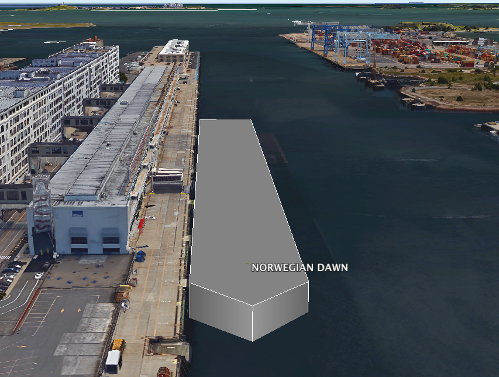
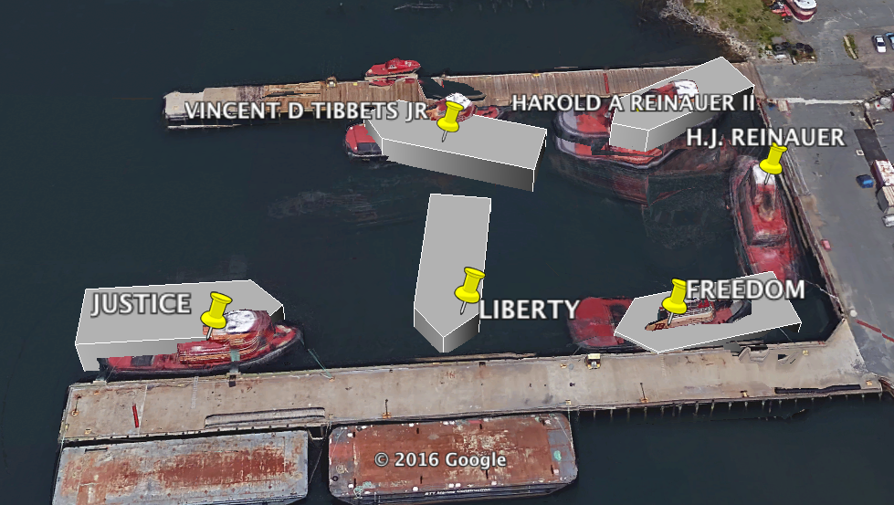
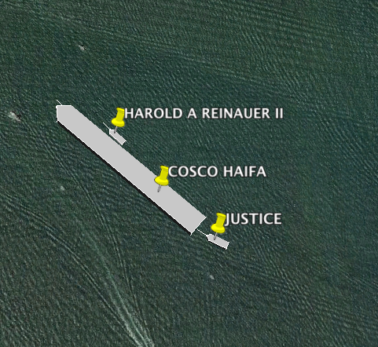
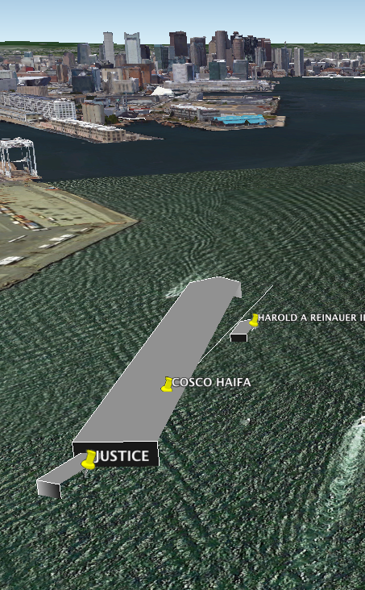
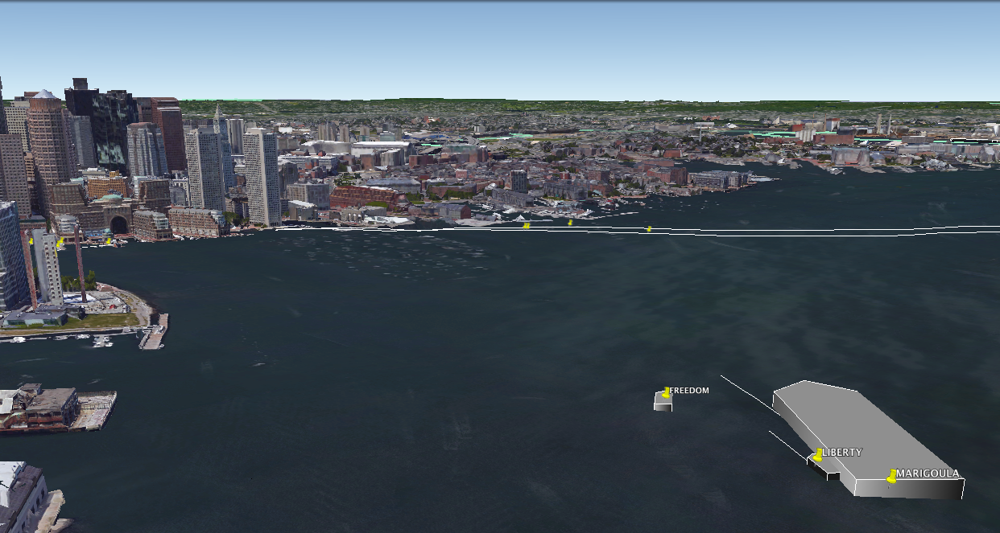

# Google Earth viewer for NMEA and AIS Data
Converts incoming NMEA/AIS data to a live Google Earth overlay of ship positions, demonstrating the capabilities of the nmea_plus gem:
https://github.com/ianfixes/nmea_plus

Here are some example screenshots from a live view of Boston harbor.  See also, this video https://www.youtube.com/watch?v=yvkCEd93p_E

### Cruise ship at the dock


### Tugs at the dock
For boats that spend a lot of time at their moorings, the Google Earth imagery and the live data sometimes align.


### Tugs guiding a container ship


Note that this image is from an earlier buggy version where one side of the ship polygon was not drawn -- I didn't connect the last point back to the initial one.




### Tugs guiding a bulk carrier
Note the white lines drawn under the ships.  Since the position updates do not happen every second, it's helpful to use their reported speed and bearing to estimate their position -- rather than falsely believe they have stayed put for ten seconds.




## Installation

This is not a published Gem, due to custom features in some dependent gems that (as of this writing) have not been accepted and/or published upstream.

```console
$ git clone git@github.com:ianfixes/nmea_plus_google_earth.git
$ cd nmea_plus_google_earth
$ bundle install
```

## Operation

### Demo program

To watch a brief demo with canned data (recorded in Boston harbor), run

```console
$ bundle exec ruby exe/canned_data_demo.rb
```

and add `http://localhost:7447` as a network link in Google Earth.  You may need to configure the link to refresh at some regular interval (I use 4 seconds to avoid flickering).


### Write your own program

All that is necessary is a [Ruby IO object](https://ruby-doc.org/core-2.1.5/IO.html) source for the input data (which can be a file, string, serial port, network connection, etc) -- technically anything that provides `each_line`.  For example, here is a process that will read data from the serial port and publish on port `12345`.

```ruby
require 'nmea_plus_google_earth'
require 'serialport'

server = NMEAPlusGoogleEarth::GoogleEarthVisualizer.new(12345)
server.process(SerialPort.new("/dev/tty.usbserial", 38400, 8, 1, SerialPort::NONE))
```
